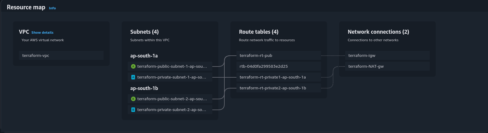

# Terraform AWS VPC Infrastructure



## 📘 Overview

This Terraform project provisions a fully functional AWS Virtual Private Cloud (VPC) with:

- Public and private subnets across multiple Availability Zones (AZs)
- Internet Gateway for public subnet internet access
- NAT Gateway for outbound internet from private subnets
- Route tables with subnet associations
- Modular code structure for reusability

## ✅ Prerequisites

- [Terraform v1.0+](https://www.terraform.io/downloads)
- AWS credentials configured via environment variables or CLI (`aws configure`)
- AWS Provider v4.0+

---

## 🚀 Usage

1. **Clone the Repository:**
```bash
git clone https://github.com/SHIVANIUM-GIT/terraform_vpc.git
cd terraform-aws-vpc
````

2. **Initialize Terraform:**

```bash
terraform init
```

3. **Preview the Plan:**

```bash
terraform plan
```

4. **Apply the Configuration:**

```bash
terraform apply
```

---

## ⚙️ Configuration

### Required Variables (`terraform.tfvars`)

```hcl
project_name = "terraform"
cidr_block   = "10.0.0.0/16"

pub_subnet   = ["10.0.1.0/24", "10.0.2.0/24"]
pri_subnet   = ["10.0.3.0/24", "10.0.4.0/24"]
azs          = ["ap-south-1a", "ap-south-1b"]
```

> All these variables are declared in `variables.tf` and consumed in `main.tf` using the module `./modules/vpc`.

---

## 🛠️ Optional Customizations

* Modify CIDR blocks in `terraform.tfvars` or `variables.tf`
* Add more subnets or additional AZs for high availability
* Extend the module to include Security Groups, EC2, ALB, etc.
* Add tags for cost tracking and organization policies

---

## ✅ Best Practices

* Run `terraform plan` before every `apply`
* Use backend state storage (e.g., S3 with locking via DynamoDB) in team settings
* Monitor NAT Gateway usage and cost
* Consider multiple NAT Gateways for multi-AZ HA setups

---

## 🧹 Clean Up

To destroy all created resources:

```bash
terraform destroy
```

This will remove all infrastructure created by Terraform for this project.

